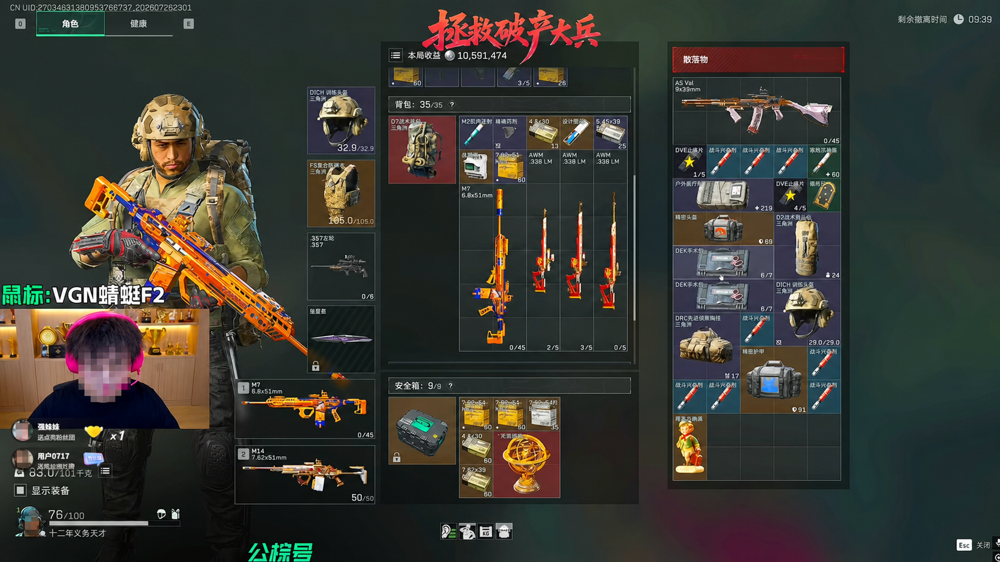
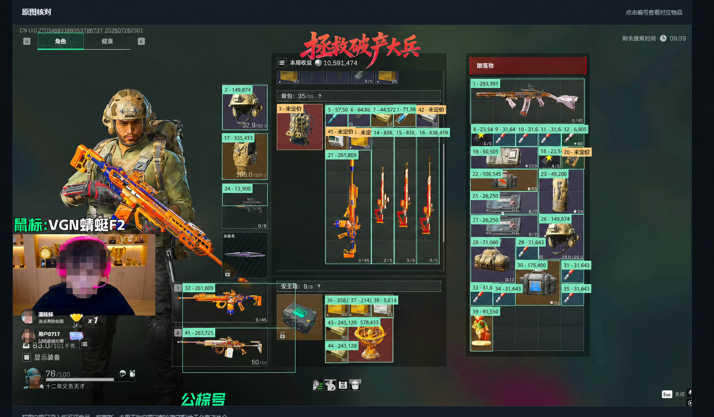
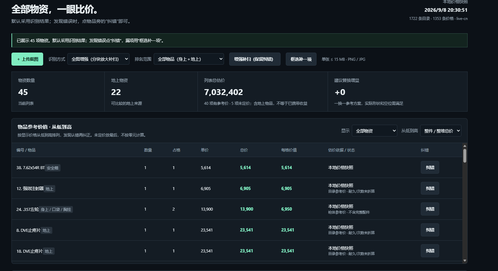
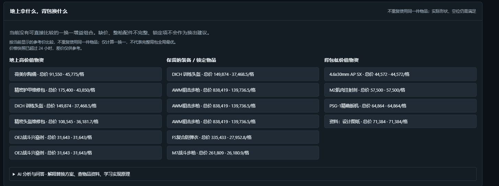

# 三角洲最高收益理包助手

## 产品介绍

三角洲最高收益理包助手是一款在 Windows 本地运行的《三角洲行动》物资识别、价格分析与背包决策辅助工具。用户主动导入或截取物资页面后，系统通过多尺度 OCR、名称检索、图标特征和空间位置生成物品候选，并关联本地 SQLite 价格快照，展示物品单价、整件/整堆总价和每格价值。

- **自动识别与价格匹配**：识别截图中的物资候选、数量、位置和占格信息，按本地价格快照计算参考价值；未知或缺价物品会单独标记，不会被静默当成零元。
- **背包优化建议**：使用 OR-Tools CP-SAT 对地上物资和背包物资进行不重复的一换一匹配，寻找参考总价差更高且占格数相容的替换方案，同时保护锁定物品、身上装备、安全箱物品和配置不完整的整枪。
- **内置 AI 对话**：通过本地 BM25 检索规则、目录、当前物资和差价证据，支持询问物品信息、价格依据、替换原因和使用流程；可选择本机 Ollama 或经用户明确授权的 DeepSeek。AI 只解释证据和程序结果，不修改价格，也不直接控制游戏。
- **本地与只读设计**：不注入游戏、不读取进程内存、不抓包、不发送鼠标键盘操作，也不默认上传截图。价格更新必须由用户主动触发，日常识别和求解只读取本地快照。

> 当前版本是可运行、可审计的辅助原型。自动识别结果仍需人工复核；替换建议采用简化的一换一匹配模型，只检查占格数，不代表完整二维背包布局或全局最高撤离收益。

### 截图识别输入

用户主动提供物资截图，系统从画面中定位并识别候选物品。下图中的真人面部已遮挡。



### 识别后的效果

系统会在原图上标注识别到的物品范围、编号和参考总价，未获得价格或仍需核对的候选会明确显示为“未定价”，方便用户逐项检查和纠正。



### 自动价格识别与排序

识别结果会关联本地价格快照，并按整件/整堆总价展示物品数量、占格、单价、总价和每格价值。



### 背包优化建议与 AI 对话

页面对比地上高价值物资、需要保护的装备和背包低价值物资，并提供可展开的 AI 分析与问答入口。



## 已实现

- 全局 `F8` 截图/追加扫描，`F9` 完成扫描并求解，`Esc` 隐藏置顶侧边窗。
- 只接受 1920×1080 画面，支持首次区域校准预览、滚动区域补拍提示和多截图合并。
- RapidOCR 3.9.2 本地中文 OCR、名称模糊匹配、OpenCV ORB 图标特征以及固定储物格校准。模板由本地目录记录的图标地址构建，识别时只读取缓存。
- 当前原型中，全部截图候选需核对；匹配分不是识别准确率。待核对列表展示名称候选和裁剪，确认时更新原物品，不重复计价。
- 人工添加、改名、修改数量/耐久/单价、删除、锁定物品，并可通过“装配到”列维护枪械配件关系。
- 本地 JSON/CSV 价格包导入、SQLite 版本保留、回滚、赛季及 24 小时过期提醒。
- 用户授权的三角洲数据帝手动日更快照；Token 由 Windows DPAPI 加密保存，
  基础物品和价格写入 SQLite，24 小时内禁止重复请求且不会后台轮询。
- 弹药按实际发数估价；整枪和已装配配件合成估价且避免重复计算。
- 二维多容器 CP-SAT 求解，支持方向、隔断、安全箱限制、弹药合并、弹匣装弹、武器栏、配件槽位、兼容性、锁定物品及背包/胸挂替换。
- 固定目标优先级：总价值、安全箱保护价值、操作次数、重量。
- 明确区分 `OPTIMAL` 和 `FEASIBLE`，并显示当前价值、目标价值、净增益、布局与编号操作步骤。
- 展示候选单价、参考总价、目录占格和单格参考价。未定价项目单独标记；扫描未完成、未核对、缺价格或整枪配件不全时，不给出优先丢弃建议。
- 可选贡献识别样本；只在用户确认/锁定物品后保存内存中的物品裁剪和标签，不保存完整截图。
- PyInstaller 单目录程序和 Inno Setup 安装包脚本。

## 安全边界

本程序不注入游戏、不读取进程内存、不抓包、不覆盖游戏画面、不发送鼠标键盘操作，也不实现反检测功能。它不会访问 KK 一图流；只有用户主动点击“手动日更”时，才使用用户合法取得的三角洲数据帝 Token 生成一次本地快照。

公开发布前需要另行确认游戏名称、图标、素材和数据授权，并持续核对游戏用户协议。

## 当前数据限制

仓库不分发真实价格、Token 或本机游戏图标缓存；本页截图仅用于展示产品工作流，真人面部已遮挡。OCR 模型由 RapidOCR 依赖包提供，扫描前检查模型文件齐全；缺失时提示重装，不在识别时下载。其许可见 [RapidOCR 项目](https://github.com/RapidAI/RapidOCR)。

本机已有本地目录、价格快照及图标缓存，无须再调用付费接口或手动制作整套模板。当前校准只适配提供的 1080p 截图布局，识别实际背包格、安全箱格及右侧物资；不包括左侧装备图标、上方未完整显示的胸挂/口袋。不同布局需重新校准。

当前已知限制：小字弹药子型号可能混淆；枪械皮肤、配件、医疗剩余用量和耐久未自动完成；目录尺寸不保证等于改装后占格；未知、遗漏和隐藏项目需人工补全。默认数量若未读到为 1，必须核对。图标相同的价格变体不能靠外观决定。单张样本不是准确率测试集，尚未达到 2 秒性能目标。识别目前同步执行，窗口在分析期间会短暂无响应。

第一版的价值排序仅在物品全部确认后给出可靠结论。默认以“单格价值”判断优先替换项，
因为它能表示有限背包空间的机会成本；界面同时保留物品总价值，用户可点击表头切换排序。

## 开发运行

要求 Windows 11、Python 3.12 x64。

```powershell
cd "C:\Users\ASUS\Desktop\delta force\delta-loot-assistant"
py -3.12 -m venv .venv
.\.venv\Scripts\Activate.ps1
python -m pip install -e ".[dev,build]"
python -m delta_loot_assistant
```

## 使用

1. 将游戏设置为简体中文、1920×1080、100% UI 缩放及无边框/窗口模式。
2. 打开理包或战利品界面，按 `F8`。
3. 按侧边窗提示滚动物资区、切换装备区或打开枪械详情，再按 `F8` 补拍。
4. 确认未知物品，修正数量、耐久、价格和枪械装配关系，锁定不能丢弃的物品。
5. 按 `F9` 完成估价；网页版可根据已经录入的地上和背包物资生成一换一替换建议。整枪若要参与比较，请核实包含配件和装填弹药的合计价，否则应先锁定。建议只检查占格数，不是完整二维布局求解。

可离线生成可核对报告（不保存完整截图、不访问网络）：

```powershell
.\.venv\Scripts\python.exe -m delta_loot_assistant.screenshot_report "截图绝对路径.png" --output "$env:LOCALAPPDATA\DeltaLootAssistant\reports\review.md"
```

## 价格包

JSON 示例见 `resources/sample_price_pack.json`。CSV 至少包含：

```csv
item_id,unit_price,durability_factor
demo_ammo,1200,1
```

JSON 包含 `schema_version`、`region`、`season`、`generated_at`、`source` 和 `prices`。`durability_factor` 可省略。

## 手动日更数据

在“价格与设置”页输入自己取得的三角洲数据帝 Token，点击“安全保存 Token”，
再点击“手动日更一次”。一次完整日更包含一次基础物品请求和一次全物品价格请求；
成功后写入 `%LOCALAPPDATA%\DeltaLootAssistant\assistant.sqlite3`。程序不会定时请求，
并会拒绝 24 小时内的重复同步。

## 测试与构建

```powershell
python -m ruff check src tests
python -m pytest
.\build.ps1
```

`build.ps1 -SkipInstaller` 强制 Python 3.12，先测试，再生成外层 `app\DeltaLootAssistant`；默认仅使用本地依赖，需要安装依赖时才显式加 `-InstallDependencies`。构建缓存位于外层 `_archive\build-cache`。不加 `-SkipInstaller` 且装有 Inno Setup 6 时，会继续生成外层 `app\installer` 安装包。构建前请退出便携版。

应用数据位于 `%LOCALAPPDATA%\DeltaLootAssistant`，包括 SQLite 价格数据库、用户模板和明确选择贡献的裁剪样本。
